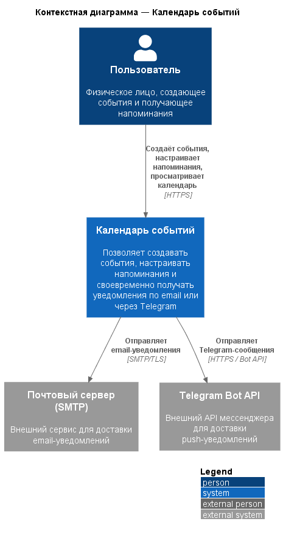
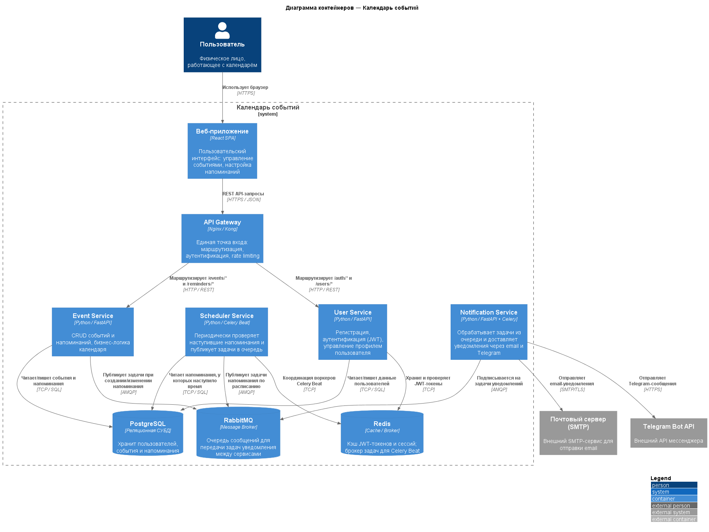
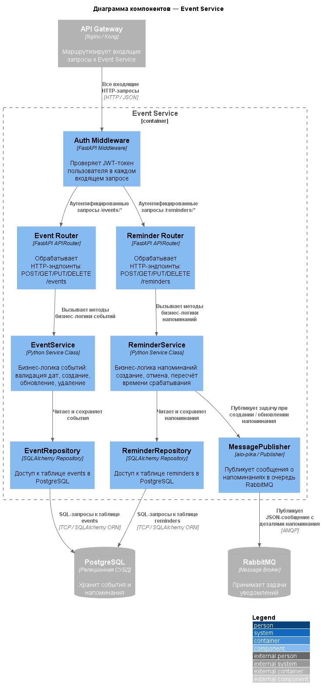
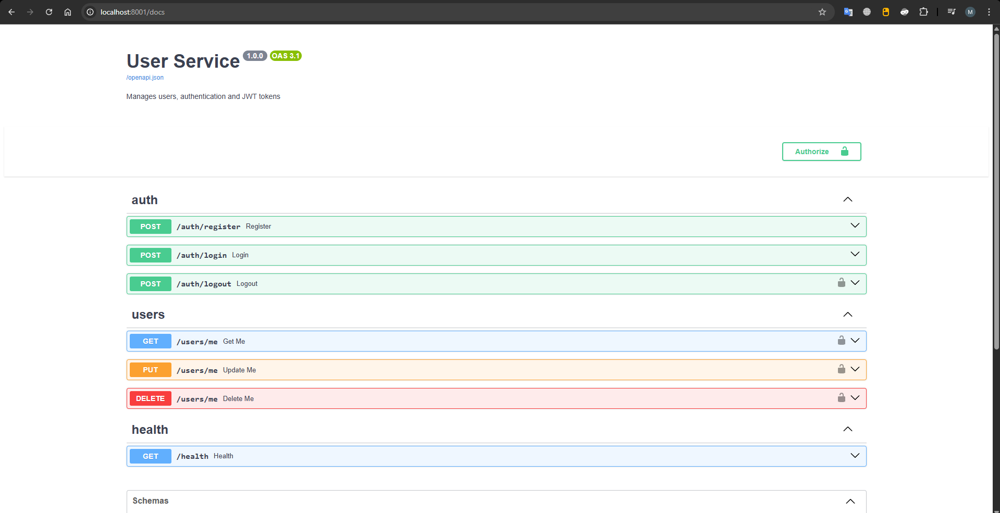
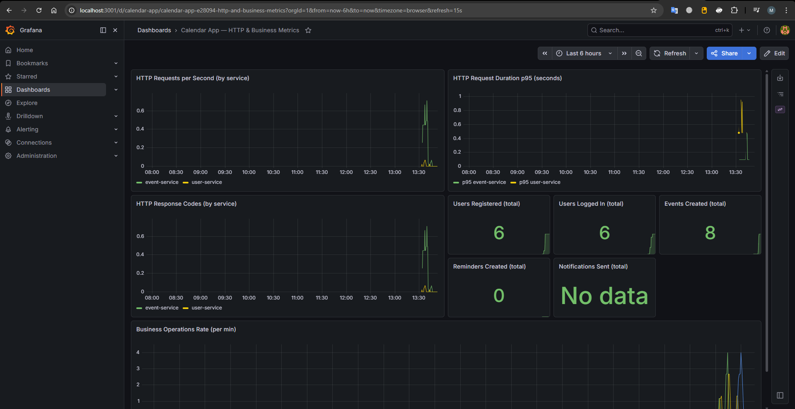
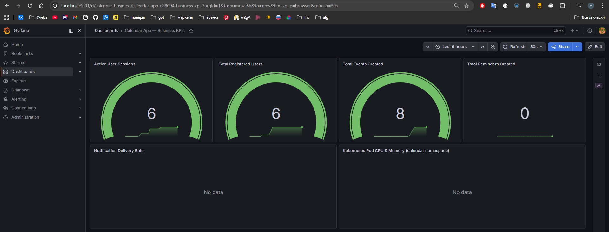
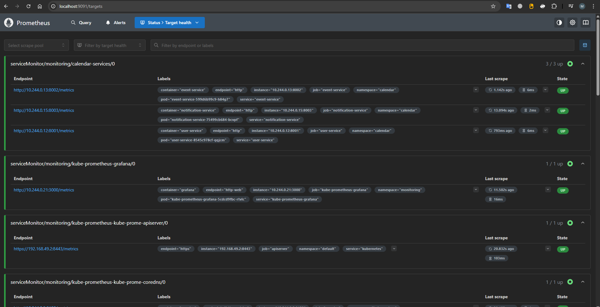
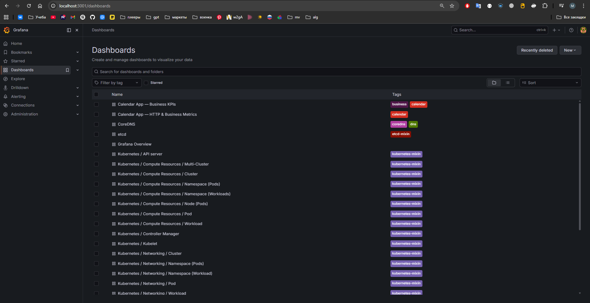
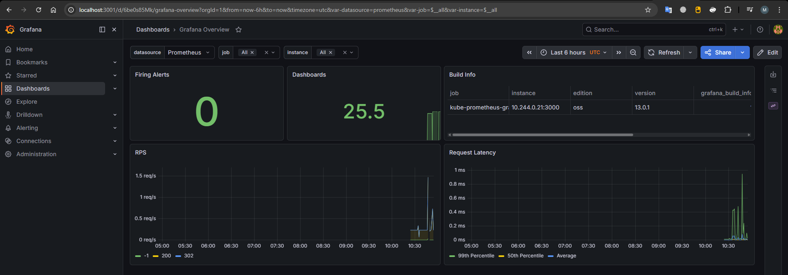
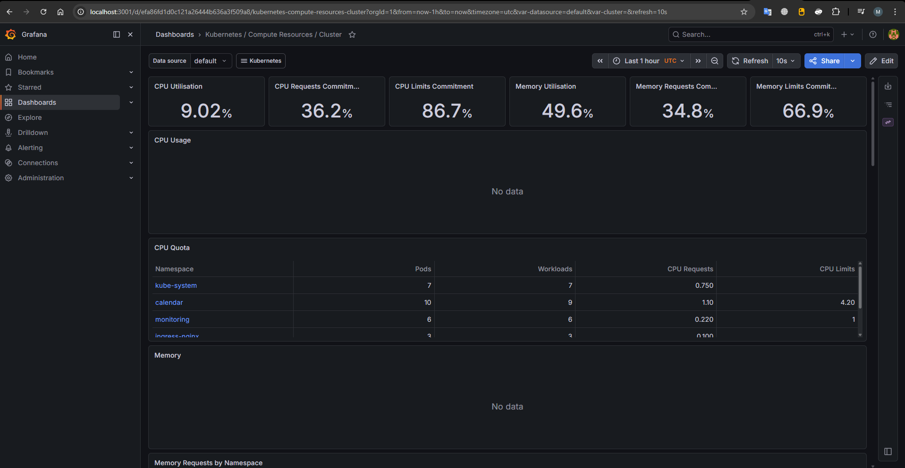

# Итоговый отчёт — Сервис «Календарь событий» с напоминаниями

**Репозиторий:** https://github.com/p0pl3/calendar_service

---

## Краткое описание темы

Система «Календарь событий» — это набор микросервисов, который позволяет пользователям создавать события, назначать к ним напоминания и получать уведомления по email в нужное время. Пользователь регистрируется, входит в систему (JWT), создаёт события с датой/временем и устанавливает напоминания. В момент наступления напоминания система автоматически отправляет письмо.

Реализована как **5 микросервисов** (API Gateway, User Service, Event Service, Scheduler Service, Notification Service) + 3 хранилища (PostgreSQL, Redis, RabbitMQ) + React-фронтенд. Развёрнута в Kubernetes (Minikube) с мониторингом, трассировкой и GitOps.

---

## Практика 1 — Архитектурное проектирование

### C4-диаграммы

#### C1 — Контекст системы



#### C2 — Контейнеры



#### C3 — Компоненты (Event Service)



### Архитектурные решения

| Сервис               | Роль                                                |
| -------------------- | --------------------------------------------------- |
| API Gateway (nginx)  | Единая точка входа, маршрутизация по URL-префиксу   |
| User Service         | Регистрация, аутентификация (JWT + Redis blacklist) |
| Event Service        | CRUD событий и напоминаний, публикация в RabbitMQ   |
| Scheduler Service    | Celery Beat: опрос БД каждые 60 с, публикация задач |
| Notification Service | Потребитель очереди, отправка email через SMTP      |

Хранилища: **PostgreSQL** (данные), **Redis** (JWT blacklist + брокер Celery), **RabbitMQ** (очередь уведомлений).

---

## Практика 2 — MVP с Docker Compose

### Поток данных

```
Браузер → API Gateway (nginx:80)
    /auth/ /users/   → User Service:8001 → PostgreSQL / Redis
    /events/ /reminders/ → Event Service:8002 → PostgreSQL / RabbitMQ
                                              → User Service (за email)
RabbitMQ → Notification Service → SMTP
Scheduler Service (Celery Beat) → PostgreSQL → RabbitMQ
```

### Таблица сервисов

| Сервис               | Порт (хост)  | Технологии                                   |
| -------------------- | ------------ | -------------------------------------------- |
| API Gateway          | 80           | nginx 1.27                                   |
| User Service         | 8001         | FastAPI, SQLAlchemy async, asyncpg, Redis    |
| Event Service        | 8002         | FastAPI, SQLAlchemy async, asyncpg, aio-pika |
| Scheduler Service    | —            | Celery Beat, psycopg2, pika                  |
| Notification Service | 8003         | FastAPI, aio-pika, aiosmtplib                |
| Frontend             | 3000         | React SPA, multi-stage Docker                |
| PostgreSQL           | 5432         | postgres:16-alpine                           |
| Redis                | 6379         | redis:7-alpine                               |
| RabbitMQ             | 5672 / 15672 | rabbitmq:3.13-management                     |

#### Swagger



### Быстрый старт

```bash
cd practice2
cp .env.example .env          # заполнить SMTP_USER, SMTP_PASSWORD
docker-compose up --build -d
# Frontend:          http://localhost:3000
# RabbitMQ UI:       http://localhost:15672  (rabbituser / rabbitpass)
# User Service docs: http://localhost:8001/docs
```

### Smoke-тест

```bash
# Регистрация
curl -X POST http://localhost/auth/register \
  -H "Content-Type: application/json" \
  -d '{"email":"demo@example.com","username":"demo","password":"password123"}'

# Логин
TOKEN=$(curl -s -X POST http://localhost/auth/login \
  -d "username=demo@example.com&password=password123" \
  | python3 -c "import sys,json; print(json.load(sys.stdin)['access_token'])")

# Создать событие
curl -X POST http://localhost/events/ \
  -H "Authorization: Bearer $TOKEN" \
  -H "Content-Type: application/json" \
  -d '{"title":"Встреча","start_time":"2025-06-01T10:00:00Z"}'
```

### Тесты

```bash
cd practice2/tests
pip install -r requirements-test.txt
python -m coverage erase
python -m pytest user-service/         --cov="../services/user-service/app"         --cov-report= --cov-append -q
python -m pytest event-service/        --cov="../services/event-service/app"        --cov-report= --cov-append -q
python -m pytest notification-service/ --cov="../services/notification-service/app" --cov-report= --cov-append -q
python -m coverage report
```

Результат: **58 passed**, покрытие **80%**.

### Переменные окружения

| Переменная                   | Описание                                          |
| ---------------------------- | ------------------------------------------------- |
| `SECRET_KEY`                 | Общий JWT-секрет для user-service и event-service |
| `SMTP_HOST/USER/PASSWORD`    | Параметры SMTP                                    |
| `POSTGRES_USER/PASSWORD/DB`  | Данные PostgreSQL                                 |
| `RABBITMQ_DEFAULT_USER/PASS` | Данные RabbitMQ                                   |
| `HOST_PORT_*`                | Хост-порты (менять при конфликтах)                |

---

## Практика 3 — Kubernetes

### Образы

| Сервис               | Образ                                  | Реплики         |
| -------------------- | -------------------------------------- | --------------- |
| api-gateway          | `calendar/api-gateway:latest`          | 1               |
| user-service         | `calendar/user-service:latest`         | 1–5 (HPA)       |
| event-service        | `calendar/event-service:latest`        | 1–5 (HPA)       |
| scheduler-service    | `calendar/scheduler-service:latest`    | 1               |
| notification-service | `calendar/notification-service:latest` | 1               |
| frontend             | `calendar/frontend:latest`             | 2               |
| postgres             | `postgres:16-alpine`                   | 1 (StatefulSet) |
| redis                | `redis:7-alpine`                       | 1               |
| rabbitmq             | `rabbitmq:3.13-management-alpine`      | 1               |

### Инструкция по развёртыванию

```powershell
# Шаг 1. Запустить Minikube
minikube start --driver=docker --cpus=4 --memory=6g
minikube addons enable ingress
minikube addons enable metrics-server

# Шаг 2. Собрать образы внутри Minikube
minikube docker-env | Invoke-Expression
docker build -t calendar/user-service:latest        practice2/services/user-service/
docker build -t calendar/event-service:latest       practice2/services/event-service/
docker build -t calendar/scheduler-service:latest   practice2/services/scheduler-service/
docker build -t calendar/notification-service:latest practice2/services/notification-service/
docker build -t calendar/api-gateway:latest         practice2/services/api-gateway/
docker build -t calendar/frontend:latest            practice2/services/frontend/

# Шаг 3. Создать секреты
Copy-Item practice3/k8s/secret.example.yaml practice3/k8s/secret.yaml
# Заполнить SECRET_KEY, SMTP_USER, SMTP_PASSWORD в secret.yaml

# Шаг 4. Применить манифесты
kubectl apply -f practice3/k8s/

# Шаг 5. Дождаться запуска
kubectl -n calendar get pods -w    # ждать Running 1/1 (2-5 мин)

# Шаг 6. Открыть доступ (от Администратора)
minikube tunnel
Add-Content -Path "C:\Windows\System32\drivers\etc\hosts" -Value "127.0.0.1  myapp.local"
# → http://myapp.local
```

### Скриншоты кластера

**Запуск Minikube:**


**Поды, сервисы, Ingress:**


**Работающее приложение:**


**PersistentVolumeClaims:**


**HPA (автоскейлинг):**


### StatefulSet и PersistentVolume

PostgreSQL развёрнут как `StatefulSet` — гарантирует стабильный сетевой идентификатор (`postgres-0`) и сохранность данных через `volumeClaimTemplates` (5 Gi). Redis и RabbitMQ используют PVC из [k8s/pvc.yaml](practice3/k8s/pvc.yaml).

### HPA

Для `user-service` и `event-service` настроен HPA: при CPU > 70% добавляются реплики (до 5), при снижении нагрузки убираются (минимум 1).

### Service Mesh — Linkerd

Namespace `calendar` аннотирован `linkerd.io/inject: enabled` — автоматическая инъекция sidecar-прокси во все поды. Даёт mTLS, метрики трафика (latency, success rate, RPS) в дашборде Linkerd Viz.

```powershell
linkerd install --crds | kubectl apply -f -
linkerd install --set proxyInit.runAsRoot=true | kubectl apply -f -
linkerd check
linkerd viz install | kubectl apply -f -
linkerd viz dashboard
```


### GitOps — ArgoCD

ArgoCD синхронизирует состояние кластера с репозиторием (папка `practice3/k8s`). При `git push` новых манифестов кластер обновляется автоматически (`automated: prune: true, selfHeal: true`).

```bash
kubectl create namespace argocd
kubectl apply -n argocd -f https://raw.githubusercontent.com/argoproj/argo-cd/stable/manifests/install.yaml
kubectl apply -f practice3/argocd-app.yaml
```


### Структура манифестов

```
practice3/k8s/
  namespace.yaml              ← Namespace calendar (Linkerd аннотация)
  configmap.yaml              ← Конфигурация
  secret.yaml                 ← Пароли и ключи (заполнить вручную)
  statefulset.yaml            ← PostgreSQL (StatefulSet + PVC 5Gi)
  pvc.yaml                    ← PVC для Redis (1Gi) и RabbitMQ (2Gi)
  deployment-*.yaml           ← Деплойменты всех сервисов
  service-*.yaml              ← Services
  ingress.yaml                ← nginx Ingress (myapp.local)
  hpa.yaml                    ← HPA для user-service и event-service
practice3/argocd-app.yaml     ← ArgoCD Application
```

---

## Практика 4 — Мониторинг и наблюдаемость

### Стек мониторинга

Выбрана связка **Prometheus + Grafana** (`kube-prometheus-stack`) + **Grafana Tempo** для трассировки.

- `kube-prometheus-stack` включает Prometheus Operator, node-exporter и kube-state-metrics «из коробки»
- `prometheus-fastapi-instrumentator` — HTTP-метрики FastAPI без кастомного кода
- Grafana sidecar автоматически подхватывает дашборды из ConfigMap
- Grafana Tempo — лёгкий бэкенд трассировки, интегрируется с Grafana как datasource

### Экспортируемые метрики

**HTTP-метрики (все сервисы):**

| Метрика                         | Тип       | Описание                                                      |
| ------------------------------- | --------- | ------------------------------------------------------------- |
| `http_requests_total`           | Counter   | Счётчик запросов с метками `handler`, `method`, `status_code` |
| `http_request_duration_seconds` | Histogram | Время ответа; позволяет считать p50/p95/p99                   |

**Бизнес-метрики (user-service):**

| Метрика                  | Тип     | Описание                               |
| ------------------------ | ------- | -------------------------------------- |
| `users_registered_total` | Counter | Число зарегистрированных пользователей |
| `users_logged_in_total`  | Counter | Число успешных логинов                 |
| `users_active_total`     | Counter | Активные сессии                        |

**Бизнес-метрики (event-service):**

| Метрика                     | Тип     | Описание                          |
| --------------------------- | ------- | --------------------------------- |
| `events_created_total`      | Counter | Созданных событий                 |
| `reminders_created_total`   | Counter | Созданных напоминаний             |
| `reminders_published_total` | Counter | Сообщений опубликовано в RabbitMQ |

**Бизнес-метрики (notification-service):**

| Метрика                      | Тип     | Описание                                   |
| ---------------------------- | ------- | ------------------------------------------ |
| `notifications_sent_total`   | Counter | Отправленные уведомления (метка `channel`) |
| `notifications_failed_total` | Counter | Неудачные доставки                         |

### ServiceMonitor

```yaml
apiVersion: monitoring.coreos.com/v1
kind: ServiceMonitor
metadata:
  name: calendar-services
  namespace: monitoring
spec:
  namespaceSelector:
    matchNames: [calendar]
  selector:
    matchLabels:
      monitoring: "true"
  endpoints:
    - port: http
      path: /metrics
      interval: 15s
```

### Дашборды Grafana

**Дашборд 1: Calendar App — HTTP & Business Metrics**

Панели: HTTP Requests per Second, HTTP Request Duration p95, HTTP Response Codes (2xx/4xx/5xx), Business Operations Rate, stat-панели бизнес-счётчиков.



**Дашборд 2: Calendar App — Business KPIs**

Панели: Active User Sessions (gauge), Total Registered Users / Events / Reminders, Notification Delivery Rate, Pod CPU Usage.



**Prometheus:**



**Другие дашборды:**





### Нагрузочный тест

| Фаза     | Параллелизм | Запросов | Время | RPS     |
| -------- | ----------- | -------- | ----- | ------- |
| Baseline | 5           | 100      | ~2 s  | ~50 RPS |
| Нагрузка | 30          | 300      | ~5 s  | ~60 RPS |

При росте до 30 concurrent запросов p95 latency вырос с ~8ms до ~45ms. HPA запустил 2-й pod user-service.

### Инструкция по запуску мониторинга

```bash
# Шаг 1. Запустить Minikube (минимум 4 CPU / 6 GB RAM)
minikube start --driver=docker --cpus=4 --memory=6144 --disk-size=20g
minikube addons enable ingress

# Шаг 2. Установить Linkerd
linkerd install --crds | kubectl apply -f -
linkerd install --set proxyInit.runAsRoot=true | kubectl apply -f -
linkerd check

# Шаг 3. Развернуть приложение
kubectl apply -f practice3/k8s/namespace.yaml
kubectl annotate namespace calendar linkerd.io/inject=enabled
kubectl apply -f practice3/k8s/

# Шаг 4. Установить стек мониторинга
kubectl create namespace monitoring
kubectl annotate namespace monitoring linkerd.io/inject=disabled
helm repo add prometheus-community https://prometheus-community.github.io/helm-charts
helm repo add grafana https://grafana.github.io/helm-charts
helm repo update
helm install kube-prometheus prometheus-community/kube-prometheus-stack \
  --namespace monitoring \
  --values practice4/monitoring/kube-prometheus-values.yaml \
  --wait --timeout 5m
helm install tempo grafana/tempo \
  --namespace monitoring \
  --values practice4/monitoring/tempo-values.yaml \
  --wait --timeout 3m

# Шаг 5. Применить конфигурацию мониторинга
kubectl apply -f practice4/monitoring/service-monitor-calendar.yaml
kubectl apply -f practice4/monitoring/grafana-datasource-tempo.yaml
kubectl apply -f practice4/monitoring/grafana-dashboard-calendar.yaml
kubectl apply -f practice4/monitoring/grafana-dashboard-k8s-business.yaml

# Шаг 6. Открыть интерфейсы
kubectl port-forward -n monitoring svc/kube-prometheus-grafana 3001:80
# → http://localhost:3001  (admin / admin)

kubectl port-forward -n monitoring svc/kube-prometheus-kube-prome-prometheus 9091:9090
# → http://localhost:9091

# Шаг 7. Нагрузочный тест
python practice4/monitoring/loadtest.py
```

### Очистка

```bash
helm uninstall kube-prometheus tempo -n monitoring
kubectl delete namespace monitoring
minikube delete
```

---

## Дополнительные усложнения

Ниже перечислены реализованные усложнения сверх базовых требований с обоснованием их ценности.

### Три и более микросервиса

Реализовано **5 сервисов**: API Gateway, User Service, Event Service, Scheduler Service, Notification Service. Разделение по зонам ответственности позволяет независимо масштабировать, деплоить и отлаживать каждый компонент.

### Асинхронное взаимодействие (RabbitMQ)

Scheduler Service публикует задачи в очередь `reminder_tasks` (durable, persistent), Notification Service — потребитель. Использован `FOR UPDATE SKIP LOCKED` в PostgreSQL для исключения дублирования при масштабировании. Асинхронный подход разрывает прямую зависимость между сервисами: падение Notification Service не блокирует работу Event Service.

### Распределённая трассировка (Grafana Tempo)

Grafana Tempo развёрнут как Helm-чарт в namespace `monitoring`. Datasource подключён через ConfigMap со sidecar-автозагрузкой. Позволяет проследить путь запроса через api-gateway → user-service → postgres без ручного добавления логов.

### PostgreSQL в StatefulSet с PersistentVolume

`StatefulSet` гарантирует стабильный идентификатор пода (`postgres-0`) и сохранность данных через `volumeClaimTemplates` (5 Gi). При перезапуске пода данные не теряются — критично для production-grade хранилища.

### OpenAPI (Swagger)

FastAPI генерирует OpenAPI-документацию автоматически: `http://localhost:8001/docs` (User Service), `http://localhost:8002/docs` (Event Service). Документация содержит все эндпоинты, схемы запросов/ответов и коды ошибок.

### Покрытие тестами > 80%

58 тестов (unit + integration) с общим покрытием 80%. Тесты используют SQLite in-memory и моки внешних зависимостей (SMTP, aio-pika, httpx) — запускаются без поднятия инфраструктуры.

### Фронтенд (React SPA)

Multi-stage Docker: `node:20-alpine` для сборки → `nginx:alpine` для раздачи статики. Axios-interceptor добавляет JWT к каждому запросу и перенаправляет на `/login` при 401.

### Интеграция с внешним API (email / SMTP)

Notification Service отправляет email через aiosmtplib. Канал указывается при создании напоминания (`channels: ["email"]`). Архитектура позволяет добавить Telegram-канал без изменения остальных сервисов.

### Graceful Shutdown и Healthchecks

Все FastAPI-сервисы используют `@asynccontextmanager lifespan` — корректно закрывают соединения с БД, Redis, RabbitMQ при остановке. Uvicorn запускается с `--timeout-graceful-shutdown 30`. Каждый сервис имеет `GET /health`, используемый в liveness/readiness пробах Kubernetes.

### HPA на основе CPU

`HorizontalPodAutoscaler` для user-service и event-service: CPU > 70% — масштабирование до 5 реплик, при снижении — обратно. В нагрузочном тесте HPA автоматически запустил второй pod user-service.

### Service Mesh (Linkerd)

Namespace `calendar` аннотирован для автоматической инъекции sidecar Linkerd. Даёт: mTLS между сервисами «из коробки», golden signals (latency, success rate, RPS) в Linkerd Viz без изменения кода, трафик наблюдаем без логирования.

### GitOps (ArgoCD)

ArgoCD Application (`practice3/argocd-app.yaml`) следит за веткой `main`. `git push` новых манифестов → автоматический `kubectl apply` в кластере. Флаги `prune: true, selfHeal: true` гарантируют соответствие кластера состоянию Git-репозитория.

### Метрики самого Kubernetes

`kube-prometheus-stack` включает node-exporter (CPU, RAM, диск, сеть узла), kube-state-metrics (состояние подов, деплойментов, HPA) и kubelet-метрики контейнеров. Доступны в стандартных дашбордах Grafana без дополнительной настройки.

### Мониторинг бизнес-показателей на отдельном дашборде

Дашборд «Calendar App — Business KPIs» отображает: Active User Sessions, Total Registered Users, Events Created, Reminders Created, Notification Delivery Rate — все в реальном времени. Отдельный дашборд позволяет команде поддержки следить за бизнес-метриками, не разбираясь в инфраструктурных.

---

## Заключение — Рефлексия

### Как изменилось понимание разработки ПО после использования ИИ

Работа с ИИ на всех этапах — от архитектурного проектирования до деплоя в Kubernetes — изменила подход к разработке. ИИ снимает когнитивную нагрузку от рутинных задач: написание boilerplate-кода (CRUD, конфиги Helm, Kubernetes-манифесты, тесты), что позволяет сосредоточиться на архитектурных решениях и бизнес-логике. Количество итераций между «идея → работающий прототип» сократилось в разы.

С другой стороны, ИИ не заменяет понимание предметной области: без знания того, как работают JWT, StatefulSet, Prometheus Operator или mTLS, невозможно ни сформулировать правильный запрос, ни распознать ошибку в сгенерированном коде. Главный эффект — **ИИ перераспределяет время**: меньше на набор и поиск синтаксиса, больше на осмысление архитектуры и отладку нетривиальных ситуаций (например, конфликт Linkerd mTLS с Prometheus Operator).

### Где применение ИИ наиболее оправдано

- **Проектирование архитектуры и диаграммы** — ИИ быстро генерирует корректный PlantUML/C4 по описанию системы
- **Конфигурационный код** (Kubernetes YAML, Helm values, nginx.conf, docker-compose) — синтаксис объёмный, ошибки очевидны, итерации быстры
- **Boilerplate FastAPI / SQLAlchemy** — CRUD-роутеры, схемы Pydantic, Alembic-миграции пишутся без ошибок
- **Тесты** — ИИ хорошо генерирует test-cases по готовой реализации, особенно для unit-тестов с моками
- **Документация** — README, инструкции по запуску, таблицы метрик формируются корректно и структурированно

### Где применение ИИ менее эффективно

- **Отладка сложных runtime-ошибок** — например, `pkg_resources` в Python 3.12-slim или конфликт mTLS потребовали ручного анализа логов и понимания цепочки зависимостей. ИИ предлагает гипотезы, но без контекста реальной системы часто промахивается
- **Нефункциональные требования к производительности** — правильный выбор размеров ресурсов (CPU/RAM для Prometheus, RabbitMQ watermark) требует знания конкретной нагрузки и опыта
- **Безопасность** — ИИ пишет рабочий код, но может пропустить тонкие уязвимости (race condition, утечка токенов, некорректный scope прав)

### Как изменится рынок ИТ

В ближайшие 3–5 лет ИИ-инструменты станут обязательным элементом профессионального инструментария — как сейчас IDE или система контроля версий. Рутинное написание кода, тестов и конфигураций переложится на ИИ, что повысит производительность команд и снизит порог входа в профессию.

Ценность разработчика сместится в сторону **архитектурного мышления** (умение декомпозировать сложную систему), **критического анализа** (распознавать ошибки ИИ), **domain expertise** (знание предметной области, которую надо автоматизировать) и **коммуникации** (правильно формулировать задачи для ИИ-агентов). Профессии, где ценилась скорость набора стандартного кода, трансформируются; профессии, требующие глубокого понимания системных ограничений и ответственности за решения, останутся востребованными.
