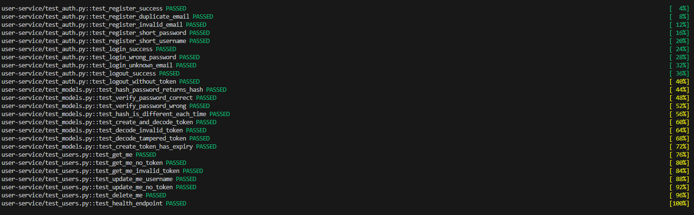
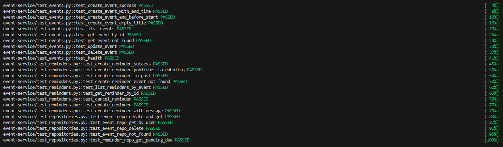
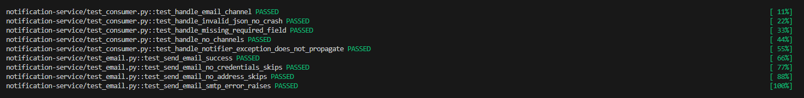
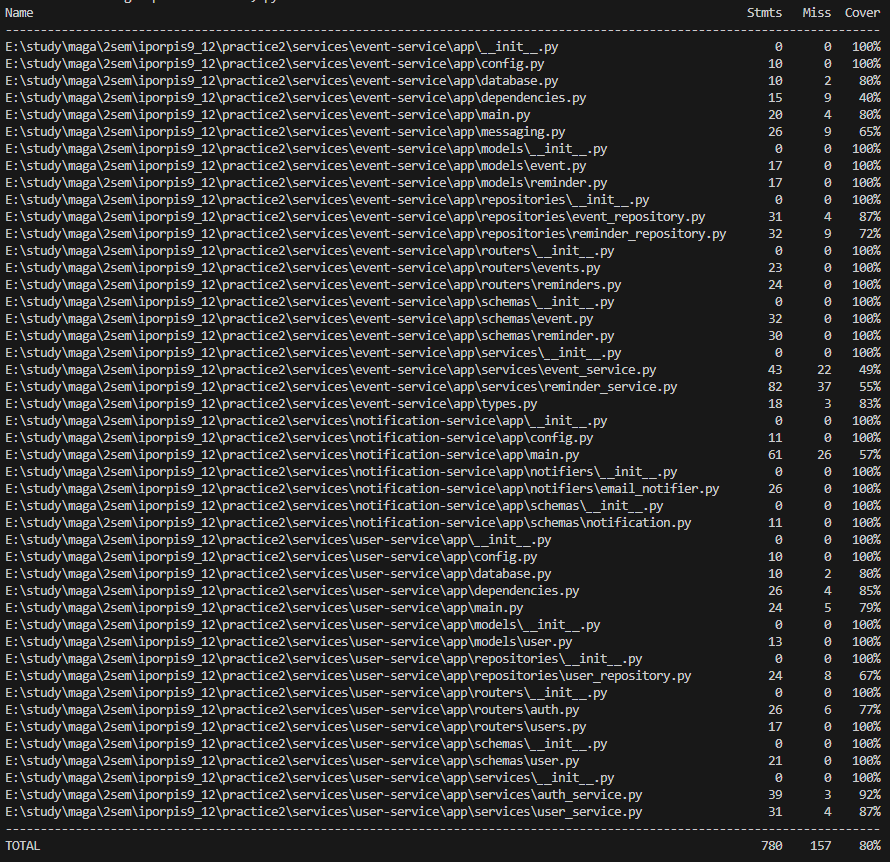
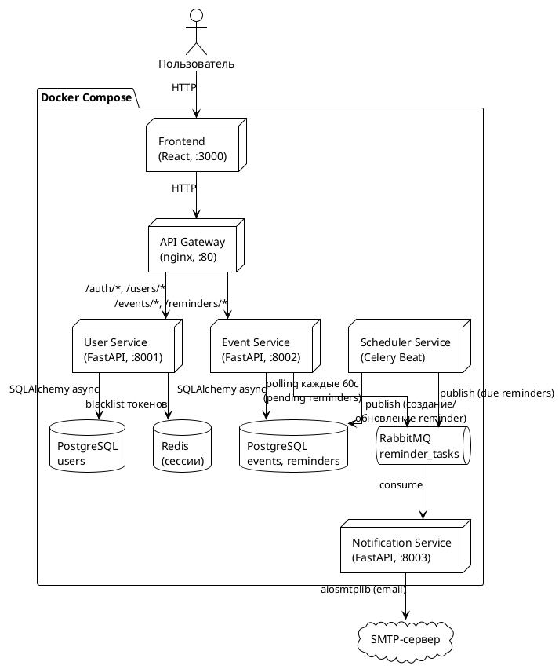
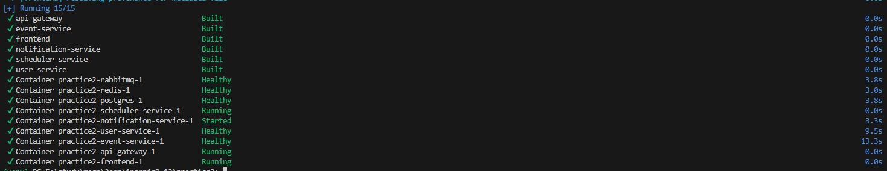

# Отчёт по практике №2 — Event Calendar с напоминаниями

## Ссылка на репозиторий

https://github.com/p0pl3/calendar_service

---

## Использованные ИИ-инструменты

| Инструмент                                               | Применение                                                                              |
| -------------------------------------------------------- | --------------------------------------------------------------------------------------- |
| **Claude Sonnet 4.6** (Anthropic, через Claude Code CLI) | Генерация всей архитектуры, сервисного кода, тестов, docker-compose, nginx конфигурации |
| **Claude Code** (CLI-плагин для VS Code)                 | Интерактивная разработка: чтение файлов, редактирование, запуск команд в терминале      |

---

## Примеры промптов, давших наиболее полезный результат

### 1. Архитектура системы

> «Спроектируй микросервисную систему "Календарь событий с напоминаниями". Сервисы: API Gateway (nginx), User Service (FastAPI + JWT + Redis), Event Service (FastAPI + RabbitMQ publisher), Scheduler Service (Celery Beat), Notification Service (aio-pika consumer + email). Хранилища: PostgreSQL, Redis, RabbitMQ. Нарисуй схему и опиши каждый сервис.»

Результат: полная архитектурная схема, описание всех сервисов, выбор технологий с обоснованием.

### 2. Генерация сервиса целиком

> «Реализуй User Service на FastAPI. Эндпоинты: POST /auth/register (201), POST /auth/login (200 JWT), POST /auth/logout (204, Redis blacklist). Таблица users: id UUID, email UNIQUE, username, hashed_password, is_active, created_at. Используй SQLAlchemy async + asyncpg, passlib[bcrypt], python-jose. Добавь lifespan для подключения к БД и Redis.»

Результат: полностью рабочий сервис со всеми файлами (models, schemas, repositories, services, routers, config, database, main).

### 3. Исправление совместимости SQLite для тестов

> «В тестах используется SQLite in-memory. Модель Event Service использует ARRAY(String) и postgresql.UUID — они не поддерживаются SQLite. Сделай кастомный TypeDecorator StringListType, который использует ARRAY для PostgreSQL и JSON-строку для SQLite. Замени postgresql.UUID на Uuid(as_uuid=False).»

Результат: рабочий `StringListType` TypeDecorator и исправленные модели без PostgreSQL-специфичных типов.

### 4. Тестовая изоляция

> «В тестах pytest появляется 409 на register при втором тесте, хотя каждый тест должен начинаться с чистой БД. Fixture engine имеет scope="session". Исправь так, чтобы каждый тест получал свежую БД.»

Результат: engine стал function-scoped с `drop_all` после yield, изоляция восстановлена.

---

## Оценка: процент кода ИИ vs вручную

| Категория                                           | ИИ       | Вручную  |
| --------------------------------------------------- | -------- | -------- |
| Сервисный код (FastAPI, модели, схемы, репозитории) | ~95%     | ~5%      |
| docker-compose.yml и Dockerfile                     | ~90%     | ~10%     |
| Тесты (conftest, test\_\*.py)                       | ~85%     | ~15%     |
| nginx.conf                                          | ~95%     | ~5%      |
| Исправление ошибок (отладка)                        | ~70%     | ~30%     |
| **Итого по проекту**                                | **~88%** | **~12%** |

Ручные правки в основном: точечные исправления после проверки работы, удаление Telegram-функциональности по решению проекта, корректировка путей в тестах.

---

## Описание возникших ошибок и галлюцинаций ИИ

### 1. Неверные пути в pytest --cov

**Галлюцинация:** ИИ указал путь `--cov=../../services/user-service/app`, предполагая два уровня вложенности. Реальная структура папок давала только один уровень вверх от `tests/`.

**Ошибка:** `WARNING: Module was never imported. No data to report.`

**Исправление:** путь изменён на `--cov="../services/user-service/app"`.

### 2. PostgreSQL-специфичные типы в SQLite-тестах

**Галлюцинация:** ИИ сгенерировал модели с `postgresql.UUID` и `ARRAY(String(50))`, не учитывая, что тесты используют SQLite in-memory.

**Ошибка:** `sqlite3.OperationalError: near "(": syntax error`

**Исправление:** заменены на `Uuid(as_uuid=False)` (кросс-DB тип SQLAlchemy) и кастомный `StringListType` TypeDecorator.

### 3. server_default=text("now()") не работает в SQLite

**Галлюцинация:** ИИ использовал PostgreSQL-функцию `now()` как server_default.

**Ошибка:** `OperationalError` при создании таблиц в SQLite.

**Исправление:** заменено на `text("CURRENT_TIMESTAMP")` — стандартный SQL, поддерживается везде.

### 4. Потеря изоляции тестов (scope="session")

**Галлюцинация:** ИИ сделал engine fixture с `scope="session"`, предполагая что `rollback` обеспечит изоляцию. Данные от одного теста утекали в следующий.

**Ошибка:** `assert 201 == 409` — регистрация завершалась конфликтом из-за данных предыдущего теста.

**Исправление:** engine стал function-scoped, добавлен `drop_all` + `dispose` после каждого теста.

### 5. 401 на endpoints с OAuth2PasswordBearer

**Галлюцинация:** ИИ переопределил зависимость `get_current_user_id`, но не учёл, что `OAuth2PasswordBearer` сам проверяет наличие `Authorization` заголовка до вызова зависимости.

**Ошибка:** `assert 201 == 401` на POST /reminders/.

**Исправление:** добавлен `headers={"Authorization": "Bearer fake-test-token"}` в `AsyncClient`.

### 6. coverage combine пропускает дубликаты

**Галлюцинация:** ИИ предложил схему с `COVERAGE_FILE` env var для разделения файлов покрытия и последующим `coverage combine`. pytest-cov игнорирует `COVERAGE_FILE`.

**Ошибка:** `Skipping duplicate data` — combine видел одни и те же данные как дубликаты.

**Исправление:** использован флаг `--cov-append` для накопления данных в один файл поэтапно.

---

## Скриншот: успешное прохождение автотестов

> Команды для запуска (из папки `practice2/tests`):
>
> ```
> python -m coverage erase
> python -m pytest user-service/ --cov="../services/user-service/app" --cov-report= --cov-append -q
> python -m pytest event-service/ --cov="../services/event-service/app" --cov-report= --cov-append -q
> python -m pytest notification-service/ --cov="../services/notification-service/app" --cov-report= --cov-append -q
> python -m coverage report
> ```
>
> Результат: **58 passed**, общее покрытие **80%**
>
> 
> 
> 
> 

---

## Схема взаимодействия микросервисов



**Поток данных для напоминания:**

1. Пользователь создаёт событие через Frontend → API Gateway → Event Service → PostgreSQL
2. Пользователь создаёт напоминание → Event Service сохраняет в PostgreSQL и публикует задачу в RabbitMQ
3. Scheduler Service (Celery Beat) каждую минуту проверяет просроченные напоминания → публикует в RabbitMQ
4. Notification Service получает сообщение из RabbitMQ → отправляет email через SMTP

---

## Скриншот: логи docker-compose up

Команда:

```
docker-compose up -d --build
```



## Swagger


