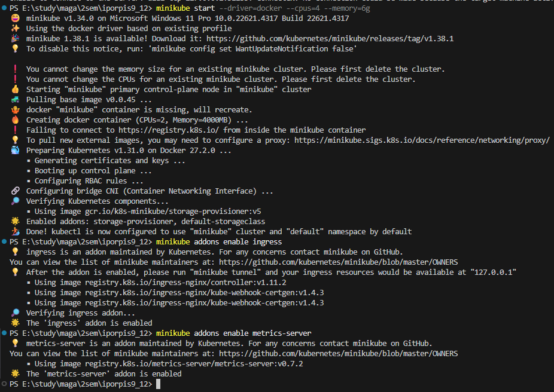
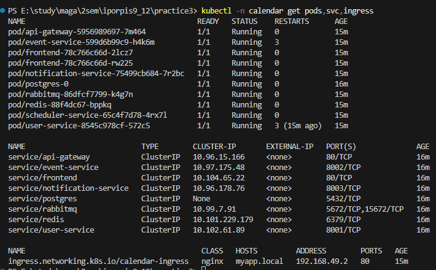
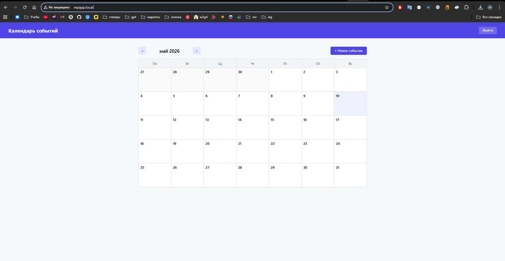
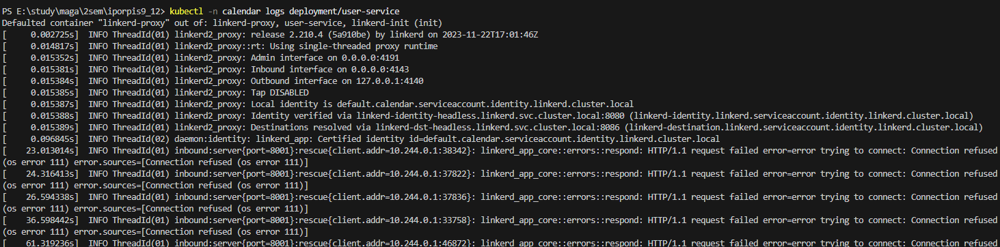
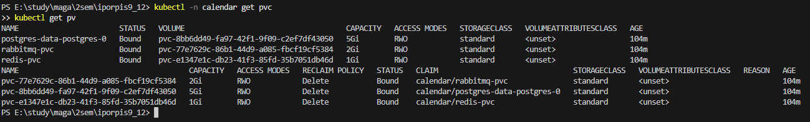
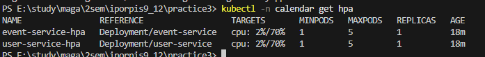
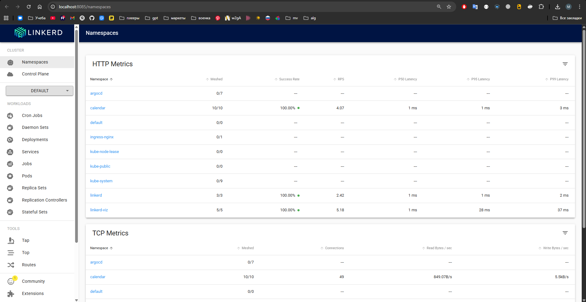
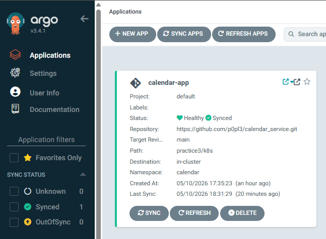

# Практика 3 — Контейнеризация и деплой микросервисов в Kubernetes

## Список микросервисов и образов

| Сервис               | Образ                                  | Порт        | Реплики         |
| -------------------- | -------------------------------------- | ----------- | --------------- |
| api-gateway          | `calendar/api-gateway:latest`          | 80          | 1               |
| user-service         | `calendar/user-service:latest`         | 8001        | 1 (HPA: 1–5)    |
| event-service        | `calendar/event-service:latest`        | 8002        | 1 (HPA: 1–5)    |
| scheduler-service    | `calendar/scheduler-service:latest`    | —           | 1               |
| notification-service | `calendar/notification-service:latest` | 8003        | 1               |
| frontend             | `calendar/frontend:latest`             | 80          | 2               |
| postgres             | `postgres:16-alpine`                   | 5432        | 1 (StatefulSet) |
| redis                | `redis:7-alpine`                       | 6379        | 1               |
| rabbitmq             | `rabbitmq:3.13-management-alpine`      | 5672, 15672 | 1               |

Все кастомные образы собираются из `practice2/services/*/` и загружаются в Minikube через `minikube image load`.

---

## Полная инструкция по развёртыванию

### Шаг 0. Установить необходимые инструменты

Если ещё не установлены:

**Docker Desktop** — https://www.docker.com/products/docker-desktop/
После установки убедиться, что Docker запущен (иконка в трее).

**Minikube:**

```powershell
# Windows (через winget)
winget install Kubernetes.minikube

# Проверить
minikube version
# minikube version: v1.32.x или выше
```

**kubectl:**

```powershell
winget install Kubernetes.kubectl

# Проверить
kubectl version --client
```

---

### Шаг 1. Запустить Minikube

```powershell
minikube start --driver=docker --cpus=4 --memory=6g

# Включить nginx Ingress Controller (нужен для доступа извне)
minikube addons enable ingress

# Включить metrics-server (нужен для HPA — автоскейлинга)
minikube addons enable metrics-server

# Проверить что всё запущено
minikube status
```

Ожидаемый вывод `minikube status`:

```
minikube
type: Control Plane
host: Running
kubelet: Running
apiserver: Running
kubeconfig: Configured
```

> Если Minikube уже был запущен раньше с меньшими ресурсами:
>
> ```powershell
> minikube stop
> minikube delete
> minikube start --driver=docker --cpus=4 --memory=6g
> ```

---

### Шаг 2. Собрать Docker-образы внутри Minikube

Minikube использует собственный Docker-демон, изолированный от системного. Нужно переключить окружение, чтобы `docker build` собирал образы прямо внутрь кластера.

```powershell
# Переключить Docker-окружение на Minikube (выполнять в каждой новой сессии PowerShell)
minikube docker-env | Invoke-Expression

# Убедиться что переключились (должно показать образы Minikube, а не локальные)
docker images | Select-String "k8s"
```

Собрать все образы (запускать из корня репозитория — папки `iporpis9_12`):

```powershell
docker build -t calendar/user-service:latest        practice2/services/user-service/
docker build -t calendar/event-service:latest       practice2/services/event-service/
docker build -t calendar/scheduler-service:latest   practice2/services/scheduler-service/
docker build -t calendar/notification-service:latest practice2/services/notification-service/
docker build -t calendar/api-gateway:latest         practice2/services/api-gateway/
docker build -t calendar/frontend:latest            practice2/services/frontend/
```

Проверить, что образы появились:

```powershell
docker images | Select-String "calendar"
```

Ожидаемый вывод — 6 строк с образами `calendar/*`.

---

### Шаг 3. Создать файл секретов

Файл `k8s/secret.yaml` не хранится в репозитории (добавлен в `.gitignore`). Нужно создать его из шаблона:

```powershell
Copy-Item practice3/k8s/secret.example.yaml practice3/k8s/secret.yaml
```

Открыть [k8s/secret.yaml](k8s/secret.yaml) и заполнить реальными значениями:

```yaml
stringData:
  SECRET_KEY: "replace-with-random-secret-key" # любая случайная строка
  SMTP_USER: "your-email@gmail.com"
  SMTP_PASSWORD: "your-app-password" # App Password из Google Account
  SMTP_FROM: "Calendar Reminder<your-email@gmail.com>"
```

Остальные значения (`POSTGRES_*`, `RABBITMQ_*`) можно оставить как в шаблоне.

---

### Шаг 4. Применить все Kubernetes-манифесты

```powershell
cd practice3
kubectl apply -f k8s/
```

Ожидаемый вывод — все ресурсы созданы/unchanged без ошибок:

```
configmap/calendar-config created
secret/calendar-secret created
namespace/calendar created
statefulset.apps/postgres created
service/postgres created
persistentvolumeclaim/redis-pvc created
...
```

---

### Шаг 5. Дождаться запуска всех подов

Инфраструктурные поды (postgres, redis, rabbitmq) должны подняться первыми, затем приложения.

```powershell
# Смотреть статус в реальном времени
kubectl -n calendar get pods -w
```

Дождаться, пока все поды перейдут в статус `Running` и `READY 1/1` (или `2/2` для frontend). Это занимает **2–5 минут**.

Ожидаемое итоговое состояние:

```
NAME                                    READY   STATUS    RESTARTS
api-gateway-xxx                         1/1     Running   0
event-service-xxx                       1/1     Running   0
frontend-xxx (x2)                       1/1     Running   0
notification-service-xxx                1/1     Running   0
postgres-0                              1/1     Running   0
rabbitmq-xxx                            1/1     Running   0
redis-xxx                               1/1     Running   0
scheduler-service-xxx                   1/1     Running   0
user-service-xxx                        1/1     Running   0
```

Если какой-то под в `CrashLoopBackOff` — смотреть логи:

```powershell
kubectl -n calendar logs deployment/user-service --tail=50
kubectl -n calendar describe pod <имя-пода>
```

---

### Шаг 6. Получить доступ к приложению

Открыть PowerShell **от имени Администратора** и запустить туннель:

```powershell
minikube tunnel
# Оставить этот терминал открытым!
```

Добавить запись в hosts (одноразово, тоже от Администратора):

```powershell
Add-Content -Path "C:\Windows\System32\drivers\etc\hosts" -Value "127.0.0.1  myapp.local"
```

После этого приложение доступно по `http://myapp.local` — Ingress-контроллер маршрутизирует запросы:

| URL                             | Описание             |
| ------------------------------- | -------------------- |
| `http://myapp.local/`           | Frontend (React SPA) |
| `http://myapp.local/auth/...`   | API (аутентификация) |
| `http://myapp.local/events/...` | API (события)        |

---

### Шаг 7. Проверить состояние кластера

```powershell
# Все поды, сервисы и Ingress
kubectl -n calendar get pods,svc,ingress

# HPA (автоскейлинг)
kubectl -n calendar get hpa

# PVC (диски)
kubectl -n calendar get pvc
```

---

### Шаг 8. Протестировать приложение

> Убедись что `minikube tunnel` запущен (Шаг 6) и `myapp.local` добавлен в hosts.

```powershell
$API = "http://myapp.local"

# Health check
curl "$API/health"
# → {"status":"ok","service":"api-gateway"}

# Регистрация
curl -X POST "$API/auth/register" `
  -H "Content-Type: application/json" `
  -d '{"email":"test@example.com","username":"testuser","password":"password123"}'
# → {"id":"...","email":"test@example.com","username":"testuser",...}

# Логин
curl -X POST "$API/auth/login" `
  -H "Content-Type: application/x-www-form-urlencoded" `
  -d "username=test@example.com&password=password123"
# → {"access_token":"eyJ...","token_type":"bearer"}

# Создать событие (подставить токен из логина)
curl -X POST "$API/events/" `
  -H "Authorization: Bearer <TOKEN>" `
  -H "Content-Type: application/json" `
  -d '{"title":"Тестовое событие","start_time":"2026-06-01T10:00:00Z"}'
# → {"id":"...","title":"Тестовое событие",...}
```

**Результаты реального smoke-теста в кластере:**

```
GET  /health                → {"status":"ok","service":"api-gateway"}
POST /auth/register         → 201, user created
POST /auth/login            → 200, JWT token issued
GET  /users/me              → 200, user profile
POST /events/               → 200, event created
GET  /events/               → 200, events list
POST /reminders/            → 200, reminder created (status: pending)
```

---

### Шаг 9. Полезные команды для отладки

```powershell
# Логи конкретного сервиса
kubectl -n calendar logs deployment/user-service -f
kubectl -n calendar logs deployment/event-service -f
kubectl -n calendar logs statefulset/postgres -f

# Зайти внутрь пода
kubectl -n calendar exec -it deployment/user-service -- sh

# Перезапустить деплоймент (если завис)
kubectl -n calendar rollout restart deployment/user-service

# Описание пода (причины падений)
kubectl -n calendar describe pod <имя-пода>

# Удалить всё и начать заново
kubectl delete namespace calendar
kubectl apply -f k8s/
```

---

### Шаг 10. Остановить / удалить кластер

```powershell
# Приостановить (сохраняет состояние)
minikube stop

# Возобновить
minikube start

# Полностью удалить кластер
minikube delete
```

---

## Скриншоты

### Запуск minikube



### kubectl get pods,svc,ingress



### Проверка запущенного приложения



### Логи пода



---

## StatefulSet и PersistentVolume

**Файл:** [k8s/statefulset.yaml](k8s/statefulset.yaml)

PostgreSQL развёрнут как `StatefulSet` — это гарантирует:

- стабильный сетевой идентификатор (pod всегда называется `postgres-0`)
- сохранность данных при перезапуске через `volumeClaimTemplates`

`volumeClaimTemplates` автоматически создаёт `PersistentVolumeClaim` на 5 Gi для каждой реплики. Minikube автоматически выделяет `PersistentVolume` через стандартный StorageClass (`standard`).

Redis и RabbitMQ используют отдельные PVC из [k8s/pvc.yaml](k8s/pvc.yaml) на 1 Gi и 2 Gi соответственно.

```bash
# Проверить PVC и PV
kubectl -n calendar get pvc
kubectl get pv
```

---



## Horizontal Pod Autoscaler (HPA)

**Файл:** [k8s/hpa.yaml](k8s/hpa.yaml)

HPA настроен для `user-service` и `event-service`:

- при загрузке CPU > 70% — добавляет реплики (до 5)
- при снижении нагрузки — убирает лишние реплики (минимум 1)

Требует включённого `metrics-server` в Minikube:

```bash
minikube addons enable metrics-server

# Проверить HPA
kubectl -n calendar get hpa

# Наблюдать за автоскейлингом в реальном времени
kubectl -n calendar get hpa -w
```

---



## Service Mesh (Linkerd)

Namespace `calendar` аннотирован `linkerd.io/inject: enabled` ([k8s/namespace.yaml](k8s/namespace.yaml)) — это включает автоматическую инъекцию sidecar-прокси во все поды.

### Установка Linkerd

**1. Установить CLI (Windows):**

```powershell
New-Item -ItemType Directory -Force -Path "$env:USERPROFILE\.linkerd2"
$ver = "stable-2.14.10"
Invoke-WebRequest -Uri "https://github.com/linkerd/linkerd2/releases/download/$ver/linkerd2-cli-$ver-windows.exe" `
  -OutFile "$env:USERPROFILE\.linkerd2\linkerd.exe"
# Добавить в PATH текущей сессии:
$env:PATH += ";$env:USERPROFILE\.linkerd2"
```

**2. Проверить совместимость и установить:**

```powershell
linkerd check --pre

# CRD
linkerd install --crds | kubectl apply -f -

# Control plane (флаг обязателен для Minikube с Docker-драйвером)
linkerd install --set proxyInit.runAsRoot=true | kubectl apply -f -

linkerd check
```

**3. После `kubectl apply -f k8s/`** перезапустить поды чтобы injector добавил sidecar:

```powershell
kubectl -n calendar rollout restart deployment --all
kubectl -n calendar rollout restart statefulset/postgres
```

Поды должны показывать `2/2 READY` (приложение + linkerd-proxy).

> **Важно:** сервисы PostgreSQL, Redis, RabbitMQ аннотированы `config.linkerd.io/opaque-ports` — это говорит Linkerd пропускать TCP-трафик этих протоколов без попытки разобрать его как HTTP.

**4. Установить Viz (дашборд):**

```powershell
linkerd viz install | kubectl apply -f -
linkerd viz check

# Открыть дашборд
linkerd viz dashboard
```

Дашборд покажет: latency, success rate, RPS для каждого сервиса.

---

скриншот



## GitOps (ArgoCD)

**Файл:** [argocd-app.yaml](argocd-app.yaml)

> Файл намеренно вынесен за пределы `k8s/` — ArgoCD CRD нужно установить до его применения, иначе `kubectl apply -f k8s/` завершится ошибкой.

ArgoCD автоматически синхронизирует состояние кластера с репозиторием `https://github.com/p0pl3/calendar_service` (папка `practice3/k8s`).

### Установка ArgoCD

```bash
# Создать namespace и установить ArgoCD
kubectl create namespace argocd
kubectl apply -n argocd -f https://raw.githubusercontent.com/argoproj/argo-cd/stable/manifests/install.yaml

# Дождаться готовности
kubectl -n argocd rollout status deployment/argocd-server

# Получить пароль admin
kubectl -n argocd get secret argocd-initial-admin-secret \
  -o jsonpath="{.data.password}" | base64 -d

# Открыть UI (в другом терминале)
kubectl port-forward svc/argocd-server -n argocd 8080:443
# → https://localhost:8080  (admin / пароль выше)
```

### Создать Application

```bash
# Применить манифест Application (после установки ArgoCD!)
kubectl apply -f practice3/argocd-app.yaml
```

После этого ArgoCD будет отслеживать `main` ветку репозитория. При `git push` новых манифестов — кластер автоматически обновится (`automated: prune: true, selfHeal: true`).

```bash
# Проверить статус синхронизации
kubectl -n argocd get applications
```

---



## Структура манифестов

```
practice3/k8s/
  namespace.yaml              ← Namespace calendar (с Linkerd аннотацией)
  configmap.yaml              ← Нечувствительная конфигурация
  secret.yaml                 ← Пароли, ключи (заполнить вручную)
  statefulset.yaml            ← PostgreSQL (StatefulSet + volumeClaimTemplates)
  service-postgres.yaml       ← Headless Service для StatefulSet
  pvc.yaml                    ← PVC для Redis и RabbitMQ
  deployment-redis.yaml       ← Redis Deployment
  service-redis.yaml
  deployment-rabbitmq.yaml    ← RabbitMQ Deployment
  service-rabbitmq.yaml
  deployment-user-service.yaml
  service-user-service.yaml
  deployment-event-service.yaml
  service-event-service.yaml
  deployment-scheduler-service.yaml
  deployment-notification-service.yaml
  service-notification-service.yaml
  deployment-api-gateway.yaml
  service-api-gateway.yaml
  deployment-frontend.yaml    ← 2 реплики
  service-frontend.yaml
  ingress.yaml                ← nginx Ingress (myapp.local)
  hpa.yaml                    ← HPA для user-service и event-service
practice3/
  argocd-app.yaml             ← ArgoCD Application (применять после установки ArgoCD)
```
