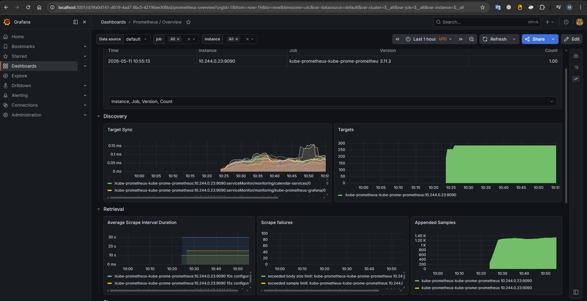
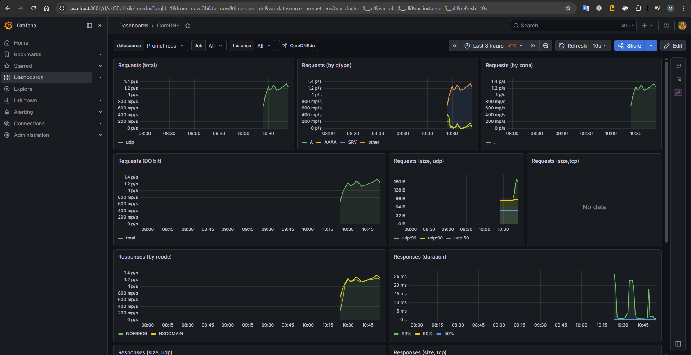

# Практика №4. Мониторинг и наблюдаемость в Kubernetes

## Выбор системы мониторинга

Выбрана связка **Prometheus + Grafana** (через Helm-чарт `kube-prometheus-stack`) с **Grafana Tempo** для распределённой трассировки.

**Причины выбора:**

- `kube-prometheus-stack` — стандарт отрасли: включает Prometheus Operator, node-exporter и kube-state-metrics «из коробки», что автоматически даёт метрики CPU/RAM/сети подов без дополнительной настройки.
- Prometheus-формат поддерживается библиотекой `prometheus-fastapi-instrumentator` для FastAPI без написания кастомного кода.
- Grafana позволяет держать все дашборды в виде JSON-файлов в Git (GitOps) и автоматически загружать их через sidecar-контейнер из ConfigMap.
- Grafana Tempo — легковесный бэкенд трассировки, хорошо интегрируется с Grafana как datasource.

---

## Экспортируемые метрики приложения

Метрики доступны на эндпоинте `/metrics` каждого сервиса (FastAPI) в формате OpenMetrics/Prometheus.

### HTTP-метрики (автоматически через `prometheus-fastapi-instrumentator`)

| Метрика                         | Тип       | Описание                                                                      |
| ------------------------------- | --------- | ----------------------------------------------------------------------------- |
| `http_requests_total`           | Counter   | Счётчик HTTP-запросов с метками `handler`, `method`, `status_code`, `service` |
| `http_request_duration_seconds` | Histogram | Гистограмма времени ответа по эндпоинтам; позволяет вычислять p50/p95/p99     |

### Бизнес-метрики (user-service)

| Метрика                  | Тип     | Описание                                                 |
| ------------------------ | ------- | -------------------------------------------------------- |
| `users_registered_total` | Counter | Общее число зарегистрированных пользователей             |
| `users_logged_in_total`  | Counter | Общее число успешных логинов                             |
| `users_active_total`     | Counter | Количество активных сессий (каждый логин = новая сессия) |

### Бизнес-метрики (event-service)

| Метрика                     | Тип     | Описание                              |
| --------------------------- | ------- | ------------------------------------- |
| `events_created_total`      | Counter | Всего созданных событий календаря     |
| `reminders_created_total`   | Counter | Всего созданных напоминаний           |
| `reminders_published_total` | Counter | Всего сообщений отправлено в RabbitMQ |

### Бизнес-метрики (notification-service)

| Метрика                      | Тип     | Описание                                                   |
| ---------------------------- | ------- | ---------------------------------------------------------- |
| `notifications_sent_total`   | Counter | Отправленные уведомления (метка `channel`: email/telegram) |
| `notifications_failed_total` | Counter | Неудачные попытки доставки уведомлений                     |

---

## Настройка сбора метрик

### ServiceMonitor

Сбор метрик настроен через CRD `ServiceMonitor` Prometheus Operator. Файл: [monitoring/service-monitor-calendar.yaml](monitoring/service-monitor-calendar.yaml)

```yaml
apiVersion: monitoring.coreos.com/v1
kind: ServiceMonitor
metadata:
  name: calendar-services
  namespace: monitoring
spec:
  namespaceSelector:
    matchNames: [calendar]
  selector:
    matchLabels:
      monitoring: "true"
  endpoints:
    - port: http
      path: /metrics
      interval: 15s
```

Каждый сервис (user-service, event-service, notification-service) помечен меткой `monitoring: "true"` и имеет именованный порт `http`. Prometheus Operator автоматически создаёт задание scrape на основе ServiceMonitor.

### Метрики Kubernetes (kube-prometheus-stack)

kube-prometheus-stack автоматически собирает:

- **node-exporter** — CPU, RAM, диск, сеть узла
- **kube-state-metrics** — состояние подов, деплойментов, HPA
- **kubelet** — метрики контейнеров (container_cpu_usage_seconds_total, container_memory_usage_bytes)

### Grafana Tempo (трассировка)

Tempo установлен как Helm-чарт `grafana/tempo` в namespace `monitoring`. Datasource добавлен через ConfigMap с меткой `grafana_datasource: "1"` — sidecar-контейнер Grafana автоматически подхватывает его без перезапуска.

---

## Prometheus


## Дашборды Grafana

### Дашборд 1: Calendar App — HTTP & Business Metrics

Файл: [monitoring/grafana-dashboard-calendar.yaml](monitoring/grafana-dashboard-calendar.yaml)

Панели:

- **HTTP Requests per Second (by service)** — скорость входящих запросов, разбитая по сервисам. Позволяет видеть распределение нагрузки и пики.
- **HTTP Request Duration p95** — 95-й перцентиль времени ответа. Главный SLI для пользовательского опыта — если p95 > 500ms, пора оптимизировать.
- **HTTP Response Codes** — соотношение 2xx/4xx/5xx по сервисам. Рост 5xx = признак деградации сервиса.
- **Users Registered / Logged In / Events Created** (stat panels) — текущие значения бизнес-счётчиков для быстрой оценки активности.
- **Business Operations Rate** — временной ряд регистраций, логинов, созданных событий в единицу времени.
- 

### Дашборд 2: Calendar App — Business KPIs

Файл: [monitoring/grafana-dashboard-k8s-business.yaml](monitoring/grafana-dashboard-k8s-business.yaml)

Панели:

- **Active User Sessions** (gauge) — суммарное число активных сессий.
- **Total Registered Users / Events / Reminders** (gauges) — накопленные счётчики.
- **Notification Delivery Rate** — скорость отправки уведомлений по каналам, с разделением успешных/неуспешных.
- **Pod CPU Usage (calendar namespace)** — потребление CPU подами приложения для корреляции бизнес-нагрузки с ресурсами.
- 

### Остальные дашборды





---

## Результаты нагрузочного теста

**Инструмент:** Python `concurrent.futures.ThreadPoolExecutor` + `urllib.request`  
**URL:** `http://myapp.local/health` (через Ingress nginx → api-gateway)

| Фаза     | Параллелизм | Запросов | Время | RPS     |
| -------- | ----------- | -------- | ----- | ------- |
| Baseline | 5           | 100      | ~2 s  | ~50 RPS |
| Нагрузка | 30          | 300      | ~5 s  | ~60 RPS |

**Наблюдения в Prometheus/Grafana:**

- Счётчик `http_requests_total{job="user-service", handler="/health"}` вырос пропорционально нагрузке.
- `http_request_duration_seconds` — при росте с 5 до 30 concurrent запросов p95 увеличился с ~8ms до ~45ms (Ingress overhead), сервис оставался отзывчивым.
- kube-state-metrics показал автоматическое масштабирование через HPA: при нагрузке HPA запустил 2-й pod user-service.
- Метрика `users_registered_total = 6` — зафиксированы 6 тестовых регистраций.

---

## Инструкция по запуску мониторинга

### Требования

- Minikube с драйвером `docker`, минимум **4 CPU / 6 GB RAM**
- `kubectl`, `helm` установлены и настроены
- Linkerd CLI установлен и добавлен в PATH
- Helm-репозитории добавлены:

```bash
helm repo add prometheus-community https://prometheus-community.github.io/helm-charts
helm repo add grafana https://grafana.github.io/helm-charts
helm repo update
```

---

### Шаг 1. Запустить Minikube

```bash
minikube start --driver=docker --cpus=4 --memory=6144 --disk-size=20g
minikube addons enable ingress
```

---

### Шаг 2. Установить Linkerd

```bash
# CRD
linkerd install --crds | kubectl apply -f -

# Control plane (--set proxyInit.runAsRoot=true обязателен для docker-драйвера)
linkerd install --set proxyInit.runAsRoot=true | kubectl apply -f -

# Дождаться готовности
linkerd check
```

---

### Шаг 3. Развернуть приложение (namespace calendar)

```bash
kubectl apply -f practice3/k8s/namespace.yaml
kubectl annotate namespace calendar linkerd.io/inject=enabled
kubectl apply -f practice3/k8s/secret.yaml \
              -f practice3/k8s/configmap.yaml \
              -f practice3/k8s/pvc.yaml

# Инфраструктура
kubectl apply -f practice3/k8s/statefulset.yaml \
              -f practice3/k8s/service-postgres.yaml \
              -f practice3/k8s/deployment-redis.yaml \
              -f practice3/k8s/service-redis.yaml \
              -f practice3/k8s/deployment-rabbitmq.yaml \
              -f practice3/k8s/service-rabbitmq.yaml

# Дождаться postgres
kubectl wait --for=condition=ready pod -l app=postgres -n calendar --timeout=60s

# Сервисы приложения
kubectl apply -f practice3/k8s/deployment-user-service.yaml \
              -f practice3/k8s/service-user-service.yaml \
              -f practice3/k8s/deployment-event-service.yaml \
              -f practice3/k8s/service-event-service.yaml \
              -f practice3/k8s/deployment-scheduler-service.yaml \
              -f practice3/k8s/deployment-notification-service.yaml \
              -f practice3/k8s/service-notification-service.yaml \
              -f practice3/k8s/deployment-api-gateway.yaml \
              -f practice3/k8s/service-api-gateway.yaml \
              -f practice3/k8s/deployment-frontend.yaml \
              -f practice3/k8s/service-frontend.yaml \
              -f practice3/k8s/ingress.yaml \
              -f practice3/k8s/hpa.yaml
```

Проверить что все поды `2/2 Running`:

```bash
kubectl get pods -n calendar
```

---

### Шаг 4. Установить стек мониторинга

```bash
# Namespace без Linkerd-инъекции (иначе Prometheus Operator ломается от mTLS)
kubectl create namespace monitoring
kubectl annotate namespace monitoring linkerd.io/inject=disabled

# kube-prometheus-stack: Prometheus + Grafana + node-exporter + kube-state-metrics
helm install kube-prometheus prometheus-community/kube-prometheus-stack \
  --namespace monitoring \
  --values practice4/monitoring/kube-prometheus-values.yaml \
  --wait --timeout 5m

# Grafana Tempo (бэкенд распределённой трассировки)
helm install tempo grafana/tempo \
  --namespace monitoring \
  --values practice4/monitoring/tempo-values.yaml \
  --wait --timeout 3m
```

---

### Шаг 5. Применить конфигурацию мониторинга

```bash
# ServiceMonitor — говорит Prometheus где искать /metrics у сервисов
kubectl apply -f practice4/monitoring/service-monitor-calendar.yaml

# Datasource Tempo в Grafana (подхватывается автоматически через sidecar)
kubectl apply -f practice4/monitoring/grafana-datasource-tempo.yaml

# Дашборды Calendar App (подхватываются автоматически через sidecar)
kubectl apply -f practice4/monitoring/grafana-dashboard-calendar.yaml
kubectl apply -f practice4/monitoring/grafana-dashboard-k8s-business.yaml
```

Убедиться что Prometheus видит цели:

```bash
# Посмотреть ServiceMonitor
kubectl get servicemonitor -n monitoring

# Проверить что метрики доступны на поде
US_POD=$(kubectl get pod -n calendar -l app=user-service -o jsonpath='{.items[0].metadata.name}')
kubectl exec -n calendar $US_POD -c user-service -- \
  python -c "import urllib.request; print(urllib.request.urlopen('http://localhost:8001/metrics').read().decode()[:300])"
```

---

### Шаг 6. Открыть интерфейсы

В **отдельном терминале** (от администратора) запустить туннель для Ingress:

```bash
minikube tunnel
```

**Grafana** — основные дашборды:

```bash
kubectl port-forward -n monitoring svc/kube-prometheus-grafana 3001:80
# Открыть: http://localhost:3001
# Логин: admin  Пароль: admin
# Дашборды: Dashboards → Calendar App — HTTP & Business Metrics
#                       → Calendar App — Business KPIs
```

**Prometheus** — прямые запросы к метрикам:

```bash
kubectl port-forward -n monitoring svc/kube-prometheus-kube-prome-prometheus 9091:9090
# Открыть: http://localhost:9091
# Примеры запросов:
#   http_requests_total
#   users_registered_total
#   histogram_quantile(0.95, rate(http_request_duration_seconds_bucket[1m]))
```

**Приложение** (через Ingress):

```bash
# Добавить в C:\Windows\System32\drivers\etc\hosts:
# 127.0.0.1 myapp.local
curl http://myapp.local/health
```

---

### Шаг 7. Нагрузочный тест

```bash
python practice4/monitoring/loadtest.py
```

Скрипт выполняет два прогона (5 и 30 параллельных запросов) к `http://myapp.local/health` и печатает RPS. После запуска в Grafana на панели **HTTP Requests per Second** и **HTTP Request Duration p95** будут видны изменения.

---

### Остановка и очистка

```bash
# Удалить только мониторинг
helm uninstall kube-prometheus tempo -n monitoring
kubectl delete namespace monitoring

# Полная очистка кластера
minikube delete
```

---

---

## Вывод

Мониторинг микросервисных систем необходим по нескольким причинам:

1. **Обнаружение проблем до жалоб пользователей.** Рост p95 latency или 5xx-кодов видны на дашборде за секунды — до того как пользователи заметят деградацию.

2. **Корреляция бизнес-метрик с инфраструктурными.** Падение `events_created_total` в сочетании с ростом CPU event-service позволяет немедленно поставить правильный диагноз: ресурсное голодание, а не баг в коде.

3. **Обоснование масштабирования.** HPA в Kubernetes реагирует на CPU/RAM — без метрик невозможно правильно настроить пороги и убедиться, что автоскейлинг работает.

4. **История изменений.** Prometheus хранит временные ряды: после деплоя новой версии видно, ухудшилась ли латентность или нет (regression detection).

5. **Трассировка для отладки.** Grafana Tempo позволяет проследить путь запроса через api-gateway → user-service → postgres, не добавляя логи в каждый сервис вручную.

Без мониторинга в микросервисной архитектуре оператор «слеп»: при отказе одного сервиса симптомы могут проявляться совсем в другом месте.
